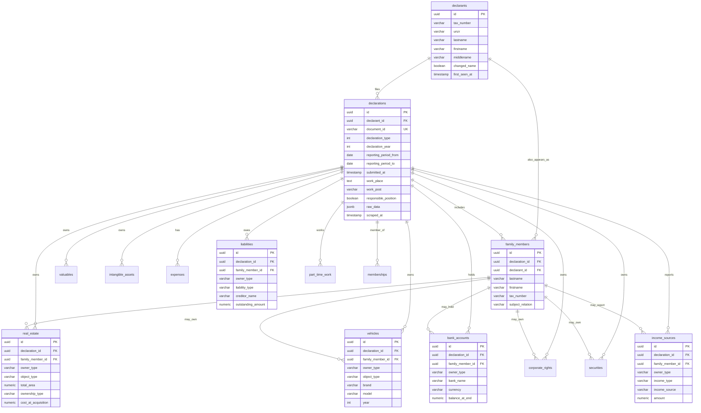

# NAZK Declarations Scraper

Scraper for Ukrainian NAZK (National Agency on Corruption Prevention) public declarations using the official API v2. Stores data in PostgreSQL with full normalization.

## Quick Start

```python
import asyncio
from src.scrapers.nazk import NAZKScraper
from src.scrapers.nazk.schemas import SearchFilters
from src.scrapers.nazk.postgres_storage import PostgreSQLStorage

async def main():
    # Use async context manager to ensure proper cleanup
    async with NAZKScraper() as scraper:
        storage = PostgreSQLStorage()

        # Search declarations from 2024
        filters = SearchFilters(declaration_year=2024)

        async for declaration in scraper.search_declarations(filters=filters, max_pages=5):
            # Fetch full declaration details
            full_data = await scraper.get_declaration(declaration.document_id)
            if full_data:
                storage.save_declaration(declaration.document_id, full_data.data)
                print(f"Saved: {declaration.declarant_name}")

asyncio.run(main())
```

## Features

- **Official API**: Uses NAZK public API (v2) with rate limiting and retry logic
- **PostgreSQL Storage**: Normalized schema with declarants, declarations, family members, and assets
- **Anti-Blocking**: User agent rotation, configurable delays, exponential backoff
- **Flexible Search**: Filter by year, type, declarant name, or date range
- **Async/Await**: Efficient concurrent requests with httpx
- **Resource Management**: Async context manager ensures HTTP connections are properly closed

## Configuration

| Parameter | Default | Description |
|-----------|---------|-------------|
| `base_url` | `https://public-api.nazk.gov.ua/v2` | API endpoint |
| `request_delay_seconds` | `2.0` | Delay between requests |
| `max_retries` | `3` | Retry attempts on failure |
| `timeout_seconds` | `30` | Request timeout |

```python
from src.scrapers.nazk.config import NAZKConfig

config = NAZKConfig(
    request_delay_seconds=3.0,
    max_retries=5,
    timeout_seconds=60
)
scraper = NAZKScraper(config=config)
```

## Database Schema

The scraper stores declarations in a fully normalized PostgreSQL database:



### Key Tables

- **declarants**: Unique persons (normalized by tax ID)
- **declarations**: Annual/termination declarations filed by declarants
  - `reporting_period_from/to`: Date range covered by this declaration
  - `submitted_at`: When the declaration was actually submitted (can have multiple per year)
  - `declaration_year`: Year for filtering/grouping
- **family_members**: Spouse, children listed in declarations
  - `declarant_id`: Optional link to declarants table to prevent person duplication
  - If a family member is also a public official (declarant), they are linked instead of duplicated
  - Example: Both spouses are public officials → each appears in declarants, linked via family_members
- **Assets**: real_estate, vehicles, bank_accounts, corporate_rights, securities, valuables, intangible_assets
- **Financial**: income_sources, expenses, liabilities
- **Work**: part_time_work, memberships

### Person Deduplication

The system prevents duplicate persons when family members are also declarants:
- When saving a family member, checks if their tax_number/unzr exists in declarants table
- If found, sets `family_members.declarant_id` to link to the existing declarant
- Allows querying all declarations for a person (both as declarant and family member)
- Maintains referential integrity without data duplication

## API Endpoints

- `GET /v2/documents/list` - Search declarations (paginated)
- `GET /v2/documents/{id}` - Fetch single declaration with full details

## License

Part of the OpenVeris project.
